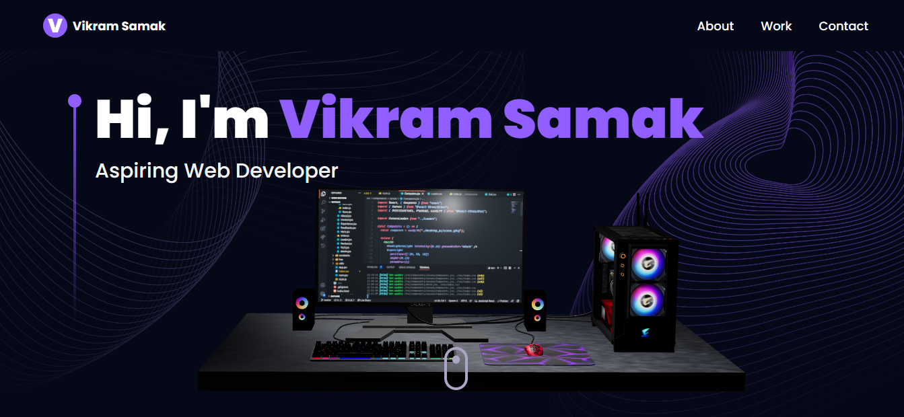
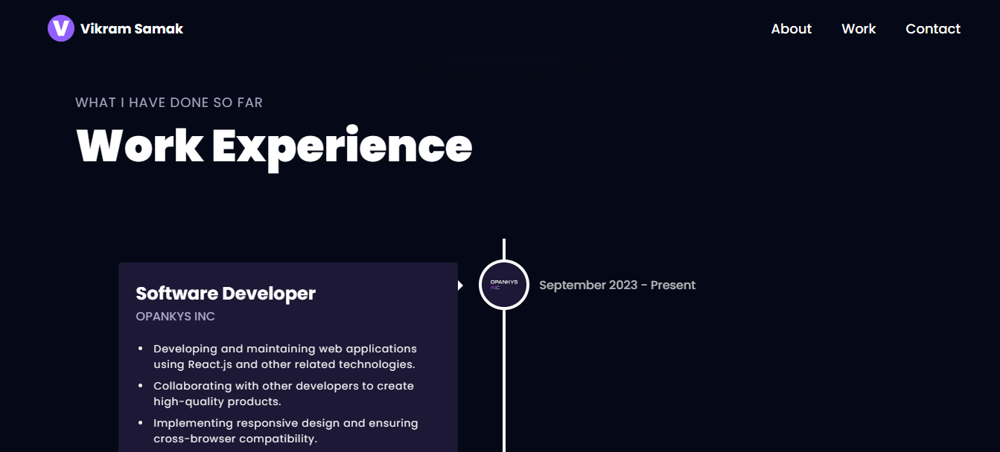
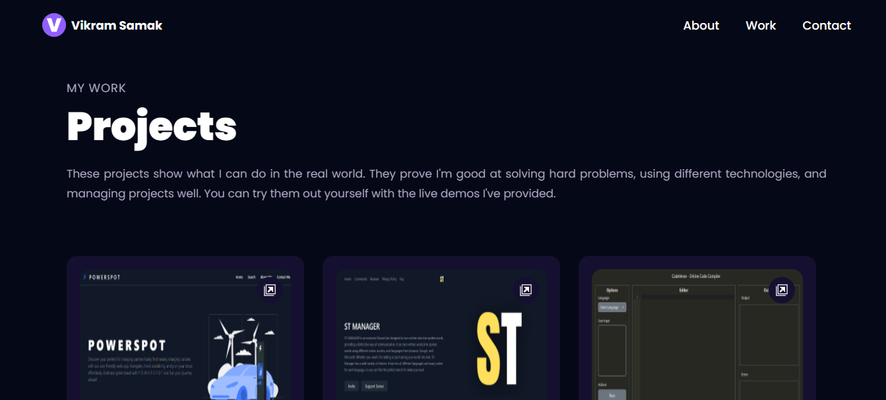
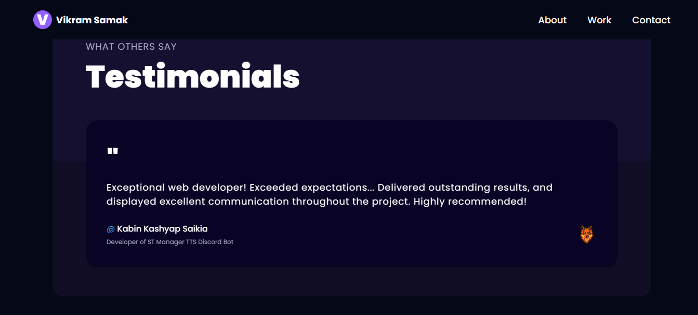

# Portfolio

 This repository represents the portfolio project developed by using React, Three.js, and EmailJS.

## Screenshots

## 🔗 Links

## Acknowledgements

This project was inspired by and adapted from [project_3D_developer_portfolio](https://github.com/adrianhajdin/project_3D_developer_portfolio) by adrianhajdin. I appreciate the work and creativity put into that project, which served as a valuable reference and inspiration for aspects of this portfolio website.
